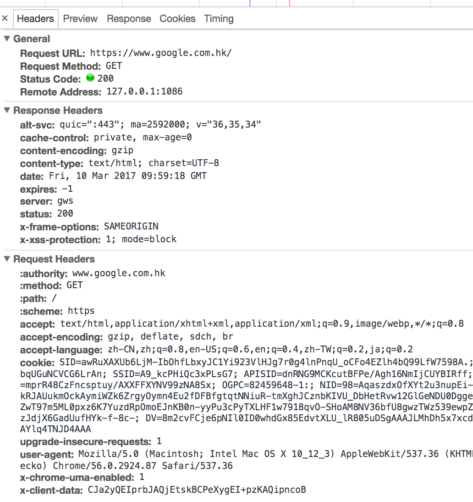
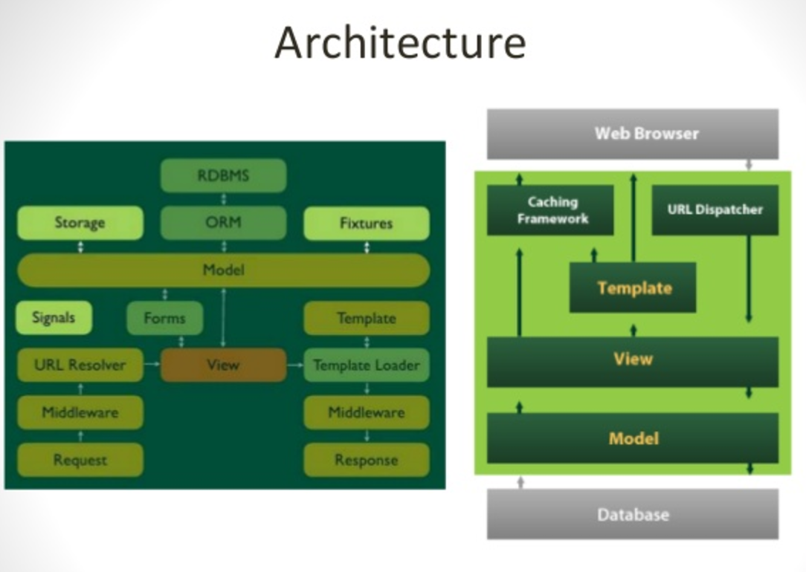
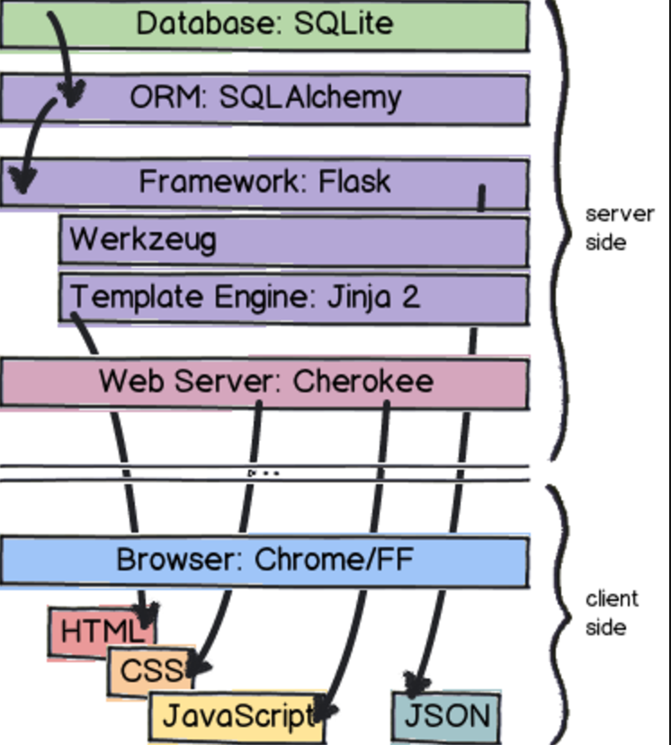
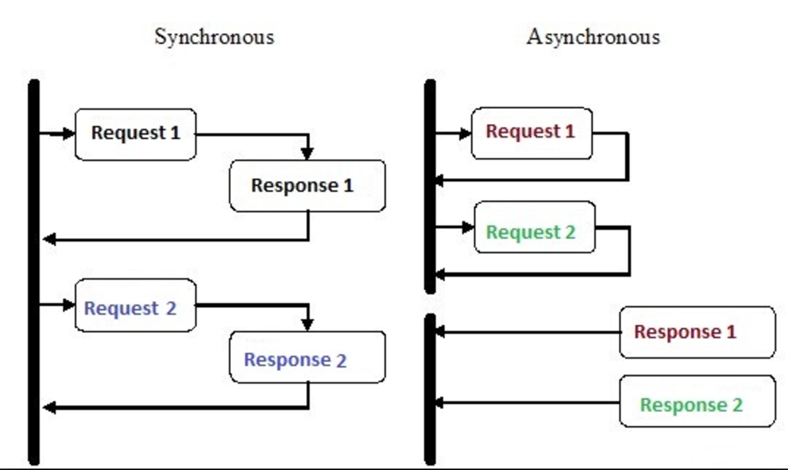

## 什么是API ？
API(Application Programming Interface)，通俗的讲是应用编程接口，就是软件系统不同组成部分衔接的约定，包括系统内部、系统与系统之间的连接协定。常见的有：

* 操作系统API
* 库与框架API (Oracle JDK，)
* 远程API (数据库协议、RPC、RMI)
* WEB API (功能服务、数据服务)

出现接口的原因：

* 统一规格，方便复用
* 封装数据，隐藏逻辑
* 控制规范，方便扩展

比如USB线电源线，即是一种电源/数据传办理硬件接口。iPhone有几种规范；Android升级了几次规格，统一成一种。

##WEB API
在网络数据传输中，无论使用TCP或是UDP，为了方便识别内容和格式，都需要在传输时设计自己的应用层协议。
最初的网络服务一般都是用RPC或SOA 作为数据传输的应用层协议，目前这种模式用于内网服务之间进行数据传输，大数据量传输时基于TCP网络性能更好。

RPC或SOA目前不再流行的主要原因是 Web的发展，基于网页的http迅速覆盖网络，拥有完整的传输、认证、加密、缓存机制。后续的手机应用客户端数据传输也全部基于http，因为理解方便基础完备。
目前的 Web API 若无特别说明，默认都是基于http协议。

下图示例了一个典型的http请求，http的核心是定义 request 和 response。

可以看到 http 本身定义了很多属性、方法 和协议；
因为每个人对它的使用不同，造成了市面上各种http请求和返回结果协定不同。

Web API领域缺乏一种最佳实践风格定义，之后被 Roy Fielding 的RESTful 占领。

## RESTful
RESTful 不像http是一种传输协议，只是一种API风格规范。它的核心是 http 缺乏的约束条件和原则。
包括：

* 关注资源而非功能
* URL 域名设计
* API版本和路径设计
* Http Method实践
* Http 参数过滤设计
* 状态码 http status设计
* 返回结果规范
* Hypermedia API 超媒体API （即返回结果中提供链接，不需要查文档即可知道下一步）
* API 服务认证规范 (OAuth2.0)

发展历史：
2007年 ruby on rails 模式，是RESTful机制最成功的案例，颠覆了旧的web开发模式。
2010年 twitter 提出的 API first, 合并了网站/应用服务/手机站 等为一端。
随后富前端模式盛行，Web API 服务端开始往数据服务发展，Node等中间层服务也开始界入。

> [https://github.com/interagent/http-api-design](https://github.com/interagent/http-api-design)  API设计规范

这议题略大，需要单独拿出来分享。

## CGI
上面谈到了 http协议和 http的 RESTful 的风格规范。
另外一个很重要的问题是，服务接收到到http协议数据之后，怎么转到 python的应用程序，应用程序处理完之后又怎么交给http层返回。这部分由CGI (Common_Gateway_Interface) 完成。
CGI 发展到 FastCGI，之后因为python里面web框架太多，为了兼容各种web框架，出现了 wsgi 兼容各种框架。

## Python Web Framework

### Django:
全能型框架：
优点：开发快速，拥有自己的Admin数据管理后台，第三方工具齐全，性能折中。
缺点：功能太多，数据分表复杂，高性能扩展复杂。

### Flask:
微型web框架
优点： SQlAlchemy, Jinja2, werkzeug 都是业内性能&设计很出色的方案，flask将这些出色的方案组合在一起，只负责衔接。Flask本身升级慢改动小，核心是周边组件的升级。
缺点：如果只是小型项目开发成本很低，大型项目需要学习了解周边组件，第三方组件需要自主开发。

### Tornado/AioHTTP：
Tornado或aiohttp 核心是利用协程异步解决io租塞，python的协程实现基于 生成器。
Web开发变成 关注生成器和 asyncio，解决了高并发问题，但项目复杂度变大。

