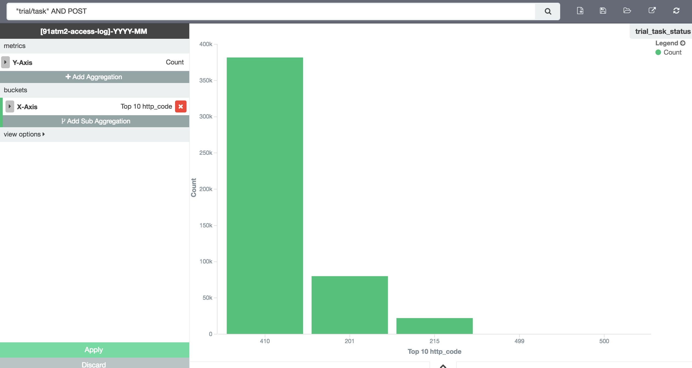

# RESTful起源
> [外部资源链接](http://blog.sae.sina.com.cn/archives/370)

从技术架构层面上看，Web的技术架构包括了四个基石：

* URI
* HTTP
* HyperText（除了HTML外，也可以是带有超链接的XML、JSON、YML等）
* MIME

在这四个基石之上，Web开发技术的发展可以粗略划分成以下几个阶段：

1. 静态内容阶段：在这个最初的阶段，使用Web的主要是一些研究机构。Web由大量的静态HTML文档组成，其中大多是一些学术论文。
2. CGI程序阶段：在这个阶段，Web服务器增加了一些编程API。通过这些API编写的应用程序，可以向客户端提供一些动态变化的内容。Web服务器与应用程序之间的通信，通过CGI（Common Gateway Interface）协议完成，应用程序被称作CGI程序。
3. 脚本语言阶段：在这个阶段，服务器端出现了ASP、PHP、JSP、ColdFusion等支持session的脚本语言技术，浏览器端出现了Java Applet、JavaScript等技术。使用这些技术，可以提供更加丰富的动态内容。
4. 瘦客户端应用阶段：在这个阶段，在服务器端出现了独立于Web服务器的应用服务器。同时出现了Web MVC开发模式，各种Web MVC开发框架逐渐流行，并且占据了统治地位。基于这些框架开发的Web应用，通常都是瘦客户端应用，因为它们是在服务器端生成全部的动态内容。
5. RIA应用阶段：在这个阶段，出现了多种RIA（Rich Internet Application）技术，大幅改善了Web应用的用户体验。应用最为广泛的RIA技术是DHTML+Ajax。Ajax技术支持在不刷新页面的情况下动态更新页面中的局部内容。同时诞生了大量的Web前端DHTML开发库，例如Prototype、jQuery/jQuery UI等等，很多开发库都支持单页面应用（Single Page Application）的开发。
6. 移动Web应用阶段：在这个阶段，出现了大量面向移动设备的Web应用开发技术。除了Android、iOS等操作系统平台原生的开发技术之外，基于HTML5的开发技术也变得非常流行。在这个阶段Js升级到ES2017，语言本身快速发展，相关的Html5特性快速增长，浏览器特性增强，Node.JS快速发展；MVVM、Virtual DOM和同构的技术解决方案越来高效。React技术栈让Web技术达到了新的技术高度。

从上面的发展历程可以看出来，无论是Web或是客户端对API的诉求会越来越强。

在上篇Web API的介绍中已经说明过，RESTful是一种架构风格，是为了弥补HTTP传输协义作规范不够严谨而定义的。

## 风格定义
Fielding博士的Architectural Styles and the Design of Network-based Software Architectures的博士论文（中文版名为《架构风格与基于网络的软件架构设计》），本身就是在定义架构规范。

REST架构风格最重要的架构约束有6个：

* 客户-服务器（Client-Server)
	
	通信只能由客户端单方面发起，表现为请求-响应的形式。

* 无状态（Stateless）
	
	通信的会话状态（Session State）应该全部由客户端负责维护。

* 缓存（Cache）
	
	响应内容可以在通信链的某处被缓存，以改善网络效率。

* 统一接口（Uniform Interface）
	
	通信链的组件之间通过统一的接口相互通信，以提高交互的可见性。

* 分层系统（Layered System）
	
	通过限制组件的行为（即，每个组件只能“看到”与其交互的紧邻层），将架构分解为若干等级的层。

* 按需代码（Code-On-Demand，可选）
	
	支持通过下载并执行一些代码（例如Java Applet、Flash或JavaScript），对客户端的功能进行扩展。
	
REST的五个关键词：

- 资源（Resource）
- 资源的表述（Representation）
- 状态转移（State Transfer）
- 统一接口（Uniform Interface）
- 超文本驱动（Hypertext Driven）

6个的主要特征：

* 面向资源（Resource Oriented）
* 可寻址（Addressability）
* 连通性（Connectedness）
* 无状态（Statelessness）
* 统一接口（Uniform Interface）
* 超文本驱动（Hypertext Driven）

## 实践技巧

### 标准的 http status返回状态

与原有的http_status 全部200比起来变化在于：
	
	200-300 正常加载数据， 
	400 客户端参数错误， 
	401 用户未登陆跳转登录， 
	403 用户权限不足或被禁用， 
	410 资源丢失>> 刷新用户界面
	404 访问资源被删除或不存在，报错弹窗msg
	500 服务端异常

其他的全部都直接 {"msg": "弹窗内容", "code:": 245} ，
code为操作码，也可以定义在http层；但服务端设计上会避免出现 code 操作码。

API的设计目标是状态唯一，访问成功只有一种成功状态…

http status作用，因为状态统一，客户端可以直接在底层实现判断，避免API对接部分代码复杂。

从数据分析层面上来说，目前绝大多数网关层如nginx，会将http status， request time记入日志，

通过ELK、pandas或其他统计工具，能够实时快速的分析出目前服务状态。
最终产品、运维人员可以快速监控到线上的业务状态和性能。

上图使用 kibana ，简单配置一个接口的访问分布。

如果全部是 http status 200，只能在各应用的业务日志上分析，这样会造成访问日志浪费；
更大的问题是，一般只有Nginx访问日志可以通过运维统一配置；
本可以利用这个优势，让所有业务线的数据分析统一化，最大化数据分析平台的作用。
浪费了统一化的访问日志，从业务层收集的日志分析复杂且效益低。

### 访问路径
 /users/， get表示获取， post表示创建，put表示更新，patch表示定量更新，delete表示删除

一方面这样资源分组，URL路径最小化；避免太多功能性URL路径，功能路径通过类似 /user/set_pwd/ 协定，简单清晰；

另一方面，功能日志天然分组，同一个url下的访问情况：
可以快速通过 URL、 HTTP Method、 Http Status 聚合查询；
这样业务清晰，接口功能清晰；数据分析能够快速定位用户行为，分析每个功能的用户行为和使用频次。

简单胜于复杂~

### 接口参数
如果是客户端，需要定制 User-Agent，如果是网页端需要带上 url_path/?user_id=1245 参数。

> 客户端的UserAgent天然就是检测访问平台和版本，系统内置上传的是126个字符的手机浏览器信息；
> 
> 通过定制UserAgent将需要的设备信息、app版本号、语言、user_id等透传；

Nginx日志一般会记录UserAgent、IP、http Method、req_path、req_time、http status、bytes send等；
通过这些最小化的日志，能够快速给出一个简单的用户分析图谱。
ELK、pandas或Hadoop工具，提供了一些工具集，能够快速将用户分组聚合。

这样可以非常简单的分析目前用户各省、各地、各操作系统、各版本、各平台上的使用情况；
以及各功能接口用户使用中遇到的状态分布。

产品和运营人员，能够在分析平台上，简易明白的看到哪些人哪些地区的在使用，使用最多的功能是哪个；
进入app后，他们一般第一个操作是什么，充值或消费之前一般的行为是什么…

### 业务日志
输出日志要添加user_id标识信息，将访问日志和业务日志收集到hadoop集群中。
利用kepler工具最终显示成SQL使用状态，方便开发人员、数据分析专员、部分会使用SQL的产品经理，直接登录参照原始数据进行分析。

业务日志和访问日志定位不同，
访问日志趋向分析行为，业务日志趋向追踪并分析功能过程；

一般情况下，将访问日志和业务日志放在一起后；
分析目标会更具体，例如针对性的分析作弊行为；
建立用户图像，建立相应的反作弊系统。

###合理的数据库设计规划

合理的数据设计，可以让一切代码都变简单，也能让数据分析简化。
数据库设计会在后续独立说明。
