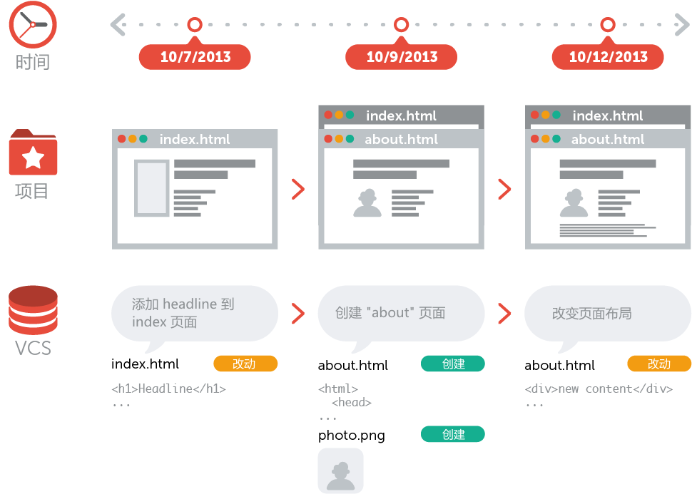

# 版本控制

## 什么是版本控制

你可以把一个版本控制系统（缩写VCS）理解为一个“数据库”，在需要的时候，它可以帮你完整地保存一个项目的快照。当你需要查看一个之前的快照（称之为“版本”）时，版本控制系统可以显示出当前版本与上一个版本之间的所有改动的细节。

## 为什么要使用版本控制系统？

在开发项目中使用版本控制系统有很多好处。本章节将向你介绍其中的一些细节。

## 协同合作

试想一下，如果没有版本控制系统，当你需要处理那些共享文件夹中的文件时，你必须告知办公室里的所有人，你正在对哪些文件进行编辑；与此同时，其他人必须要避免与操作相同的文件。这是一个不现实和完全错误的流程。当你花了很长时间完成你的编辑后，可能这些文件早已经被团队里的其他开发成员修改或者删除了。

如果使用了版本控制系统，每一个团队成员都可以在任何时间对任何文件毫无顾虑的进行修改，版本控制系统可以把之后所有的改动合并成一个共同的版本，不论是一个文件还是整个项目。这个共同的中心平台就是我们的版本控制系统。

使用版本控制还有更多优点，这就要取决于你自己或者你的开发团队了。

## 版本存储（正确地）

经常性地保存项目的改动是一个非常重要的习惯。但是如果没有版本控制系统这个操作将是非常困难的，并且非常容易出错的：

你到底改动了什么？仅仅是针对一些特定文件的改动还是整个项目？首先你必须及时并小心地审查整个项目的每一个可能的改动细节，然后你需要付出大量且并不必要的时间来整理它。

你如何命名这些版本？如果你是一个思维很有条理的人，你也许会定义一个比较容易理解的通用命名规则（比如这样 “acme-inc-redesign-2013-11-12-v23”）。然而一旦涉及到一个多样性的改变（比如：在一次版本改动中，一些改动了标题区而另一些却没有被改动它），仅仅通过名字是很难追踪和判断这些改动的。

最重要的问题可能就是你如何知道在第一个版本和第二个版本之间到底进行了哪些改动？只有很少人会真正地去花时间来仔细记录和观察每一个重要的变化，例如在项目文件夹的每一个README文件。

每一个版本控制系统仅仅对应一个项目。因此，在你的本地只存在一个版本，那就是这个项目的当前工作版本。除此之外，而其它所有之前的版本和改动都已经被有序地存储在版本控制系统中了。当你需要时，你可以随时来查看之前的任何一个版本，而且还可以得到整个项目的快照。

## 恢复之前的版本

要把一些文件恢复到上次改动之前的版本（甚至整个项目恢复到之前的版本）。这可能意味着你发现了一些严重的问题！如果你确定那些改动是错误的或者是没有必要的，那轻松的点几下你就可以简单地撤销它。在项目的每一个重要阶段，认识和正确地使用撤销这个功能会让你的工作变得非常轻松。

## 了解发生了什么

每当你提交一次对项目新的改动时，你的版本管理系统会要求你添加一个对这次改动的简短描述。除此之外（如果是一个代码或者文本文件），你还可以看到一个改动前和改动后的内容的详细对照。这样也可以帮助你很好地了解版本与版本之间的发展关系。

## 备份

备份是一个分布式版本控制系统（例如 Git）提供的非常好的附带功能。每一个团队成员都会在他的本地有一个完整的项目副本，包括整个项目的历史记录。如果你所依赖的服务器宕机了，或者是你的存储硬盘坏，所有你需要的恢复文件都可以在另外的团队成员的 Git 本地仓库中得到。

# Git
同生活中的许多伟大事物一样，Git 诞生于一个极富纷争大举创新的年代。

Linux 内核开源项目有着为数众广的参与者。 绝大多数的 Linux 内核维护工作都花在了提交补丁和保存归档的繁琐事务上（1991－2002年间）。 到 2002 年，整个项目组开始启用一个专有的分布式版本控制系统 BitKeeper 来管理和维护代码。

到了 2005 年，开发 BitKeeper 的商业公司同 Linux 内核开源社区的合作关系结束，他们收回了 Linux 内核社区免费使用 BitKeeper 的权力。 这就迫使 Linux 开源社区（特别是 Linux 的缔造者 Linus Torvalds）基于使用 BitKeeper 时的经验教训，开发出自己的版本系统。 他们对新的系统制订了若干目标：

- 速度

- 简单的设计

- 对非线性开发模式的强力支持（允许成千上万个并行开发的分支）

- 完全分布式

- 有能力高效管理类似 Linux 内核一样的超大规模项目（速度和数据量）

自诞生于 2005 年以来，Git 日臻成熟完善，在高度易用的同时，仍然保留着初期设定的目标。 它的速度飞快，极其适合管理大项目，有着令人难以置信的非线性分支管理系统。

## git简易指南

如果第一次使用。非常推荐直接使用 [SourceTree](https://www.sourcetreeapp.com/) 等界面化工具，知道简单的添加、拉取、提交，切换分支即可。

Git有很多命令和模式，简易说明 [http://www.bootcss.com/p/git-guide/
](http://www.bootcss.com/p/git-guide/)

如果想要了解更多命令使用 git。详见： [git命令](https://www.w3ctrain.com/2016/06/26/learn-git-in-30-minutes/)

如果想要完整的学习Git，请查阅图书: [Pro Git](https://git-scm.com/book/zh/v2)
