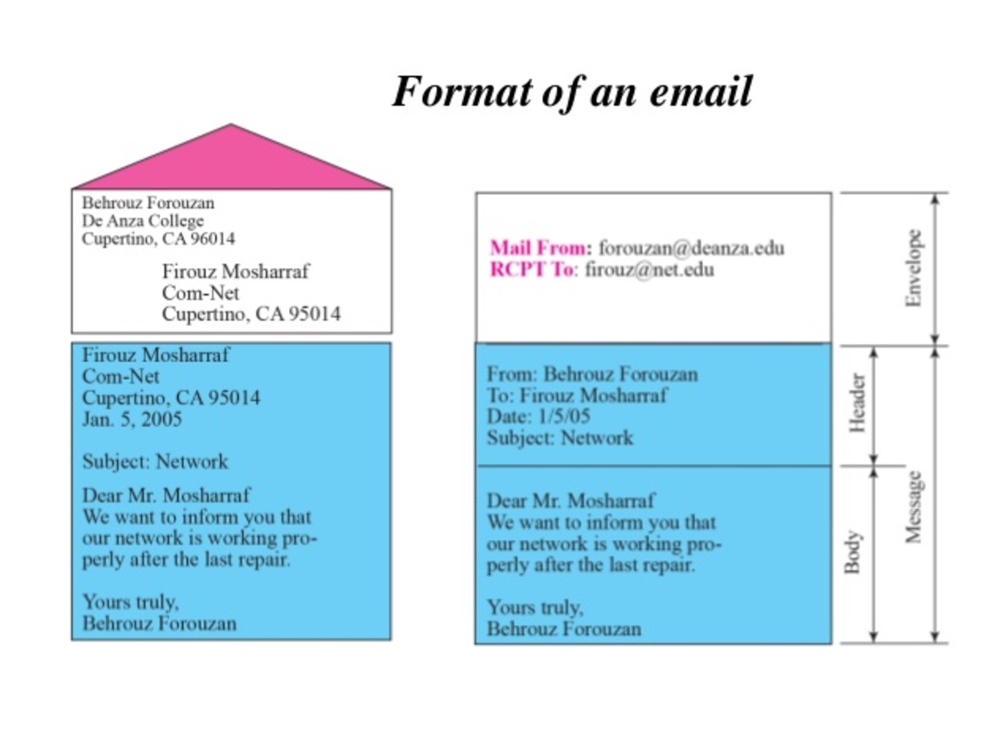

## Email格式


一封邮件包括了很多部分，排除复杂的概念介绍，本文档只简单介绍如何使用Python发出一封邮件。

发送一封邮件，需要关注的有：

- 传输协议
- 邮件格式&内容

### 传输协议
常见的邮件传输协议有以下几种：

SMTP（简单邮件传输协议）、POP3（邮局协议）、IMAP（Internet邮件访问协议）。这几种协议都是由TCP/IP协议族定义的。

- SMTP（Simple Mail Transfer Protocol）：SMTP主要负责底层的邮件系统如何将邮件从一台机器传至另外一台机器。
- POP（Post Office Protocol）：版本为POP3，POP3是把邮件从电子邮箱中传输到本地计算机的协议。
- IMAP（Internet Message Access Protocol）:版本为IMAP4，是POP3的一种替代协议，提供了邮件检索和邮件处理的新功能，这样用户可以完全不必下载邮件正文就可以看到邮件的标题摘要，从邮件客户端软件就可以对服务器上的邮件和文件夹目录等进行操作。

本部分暂时只介绍发送协议使用，其他先忽略。

### 发送邮件
```
import smtplib
 
server = smtplib.SMTP('smtp.gmail.com', 587)
server.starttls()
server.login("YOUR EMAIL ADDRESS", "YOUR PASSWORD")
 
msg = "YOUR MESSAGE!"
server.sendmail("YOUR EMAIL ADDRESS", "THE EMAIL ADDRESS TO SEND", msg)
server.quit()
```

上面的代码是发送一封简单的本文邮件，指定需要发送的邮件服务为 smtp.gmail.com，发送的文本内容为 "YOUR MESSAGE!"。

### MIME
如果发送的内容只是纯文本，邮件本身的可读性就会很低，为了扩展邮件格式，出现了MIME(Multipurpose Internet Mail Extensions)多用途互联网邮件扩展类型。它之后被扩展为互联网媒体类型，被广泛应用在浏览器和HTTP协义中。

常见的MIME类型(通用型)：
	
	普通文本 .txt text/plain
	超文本标记语言文本 .html text/html
	xml文档 .xml text/xml
	PDF文档 .pdf application/pdf
	Microsoft Word文件 .word application/msword
	PNG图像 .png image/png
	GIF图形 .gif image/gif
	au声音文件 .au audio/basic
	MIDI音乐文件 mid,.midi audio/midi,audio/x-midi
	RealAudio音乐文件 .ra, .ram audio/x-pn-realaudio
	MPEG文件 .mpg,.mpeg video/mpeg

### 多格式发送
默认发送html和纯文本，在显示html的客户端显示富文本，不支持html的显示txt文本。

```
import smtplib

from email.mime.multipart import MIMEMultipart
from email.mime.text import MIMEText

me = "my@email.com"
you = "your@email.com"

# Create message container - the correct MIME type is multipart/alternative.
msg = MIMEMultipart('alternative')
msg['Subject'] = "Link"
msg['From'] = me
msg['To'] = you

# Create the body of the message (a plain-text and an HTML version).
text = "Hi!\nHow are you?\nHere is the link you wanted:\nhttp://www.python.org"
html = """\
<html>
  <head></head>
  <body>
    <p>Hi!<br>
       How are you?<br>
       Here is the <a href="http://www.python.org">link</a> you wanted.
    </p>
  </body>
</html>
"""

# Record the MIME types of both parts - text/plain and text/html.
part1 = MIMEText(text, 'plain')
part2 = MIMEText(html, 'html')

# Attach parts into message container.
# According to RFC 2046, the last part of a multipart message, in this case
# the HTML message, is best and preferred.
msg.attach(part1)
msg.attach(part2)

# Send the message via local SMTP server.
s = smtplib.SMTP('smtp.gmail.com', 587)
s.login('userName', 'password')
# sendmail function takes 3 arguments: sender's address, recipient's address
# and message to send - here it is sent as one string.
s.sendmail(me, you, msg.as_string())
s.quit()
```
