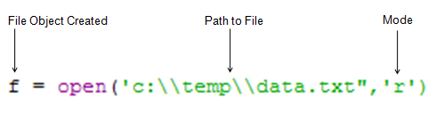
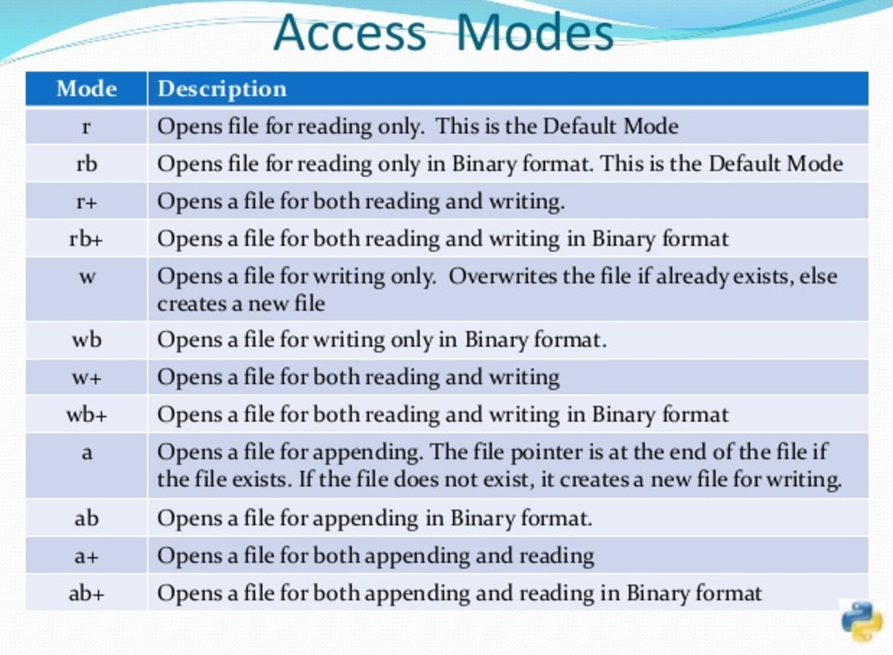

## 文件操作
文件处理包括的部分，打开之后必须关闭。
> 打开 --->  操作 ---> 关闭。

**文件打开：**



在程序中打开文件，需要指定文件路径 和 打开模式，打开模式指定文件当前的读写模式。

具体的读写模式包括：



## 文件操作示例：

**打开&关闭文件**

```
fh = open("hello.txt", "r")
fh.close()
```

为了避免忘记关闭，可以使用 with 语句 （退出with自动执行close）：

```
with open("hello.txt", "r") as fh:    
	fh.read()
```

**读取文件：**

```
fh = open("hello.txt","r")
fh.read()
```

> 关于read()方法：
> 
> 1、读取整个文件，将文件内容放到一个字符串变量中
> 
> 2、如果文件大于可用内存，不可能使用这种处理

**读取下一行:**

```
fh = open("hello.txt", "r")
fh.readline()
```
 
> readline()方法：
>
>1、readline()每次读取一行，比readlines()慢得多
>
>2、readline()返回的是一个字符串对象，保存当前行的内容


**读取文件为多行列表**

```
fh = open("hello.txt.", "r")
fh.readlines()
```

>readlines()方法：
>
>1、一次性读取整个文件。
>
>2、自动将文件内容分析成一个行的列表

**写入单行:**
> 写入模式为 w，表示覆盖原文件写入。**关闭文件都能保存**

```
fh = open("hello.txt","w")
write("Hello World")
fh.close()
```

**写入多行文件:**

```
fh = open("hello.txt", "w")
lines_of_text = ["a line of text", "another line of text", "a third line"]
fh.writelines(lines_of_text)
fh.close()
```

**添加到文件:**
> 写入模式为 a，表示在原文件尾添加内容。

```
fh = open("Hello.txt", "a")
write("Hello World again")
fh.close()
```

## 文件路径
mac 和 linux系统文件路径一致，目前不存在使用 windows系统，本部分暂忽略。

## 换行通配符
1. 在微软的MS-DOS和Windows中，使用“回车CR('\r')”和“换行LF('\n')”两个字符作为换行符;
2. Windows系统里面，每行结尾是 回车+换行(CR+LF)，即“\r\n”；
3. Unix系统里，每行结尾只有 换行CR，即“\n”；
4. Mac系统里，每行结尾是 回车CR 即'\r'。

### 换行兼容方案
**Python2**

1. 如果不是txt文件，建议用wb和rb来读写。通过二进制读写，不会有换行问题。
2. 如果需要明文内容，请用rU来读取（推荐），即U通用换行模式（Universal new line mode）。该模式会把所有的换行符（\r \n \r\n）替换为\n。注意：只支持读取。

**Python3**

python3 的open函数，添加了newline函数，默认为None 自动解决换行解析问题。

读取时候，不指定newline，则默认开启Universal new line mode，所有\n, \r, or \r\n被默认转换为\n；

写入时，不指定newline，则换行符为各系统默认的换行符（\n, \r, or \r\n, ），指定为newline='\n'，则都替换为\n（相当于Universal new line mode）；不论读或者写时，newline=''都表示不转换。


## 编码与中文处理

### 存在多种编码的原因
在计算机内部，所有的信息最终都表示为一个二进制的字符串。每一个二进制位（bit）有0和1两种状态，最初的CPU被设计为8个可以开合的晶体管，组合成256种状态，被称为一个字节（byte），用以表示世界万物。

编码是信息从一种形式或格式转换为另一种形式的过程，也称为计算机编程语言的代码，简称编码。用预先规定的方法将文字、数字或其它对象编成数码，或将信息、数据转换成规定的电脉冲信号。

解码，是编码的逆过程。

1. ASCII码
		
	美国制定了一套字符编码，对英语字符与二进制位之间的关系，做了统一规定。这被称为ASCII码，一直沿用至今。
	
2. 各国编码

	计算机发展到各个国家，各国为了解决ASCII只能存储英文&数字字符的问题，出现了自主文字编码格式。比如中文最初是GB2312，一个汉字算两个英文字节；之后因为繁体字和生僻字，扩展为GBK；然后因为少数民族字符加入，扩展为GB18030。
	
3. Unicode

	为了解决各国文字编码不同，互相无法识别的问题。ISO （国际标谁化组织）国际组织设计了”Universal Multiple-Octet Coded Character Set”，简称 UCS, 俗称 “unicode”。
	
	所有文字都是统一的“一个字符”，同时也都是统一的“两个字节”。
	
	unicode的好处是表示了所有语言，问题：
	1. 怎么和ascii码区别出来？计算机怎么知道三个字节表示一个符号，而不是分别表示三个符号呢？
	2. 英文字母只用一个字节表示就够了，如果Unicode统一规定，每个符号用三个或四个字节表示，极大浪费存储。

4. UTF-8

	互联网的普及，强烈要求出现一种统一的编码方式。为解决unicode如何在网络上传输的问题，于是面向传输的众多UTF（UCS Transfer Format）标准出现了。UTF-8就是每次8个位传输数据，而UTF-16就是每次16个位。
	
	UTF-8的编码规则很简单，只有二条：
	1. 对于单字节的符号，字节的第一位设为0，后面7位为这个符号的unicode码。因此对于英语字母，UTF-8编码和ASCII码是相同的。
	2. 对于n字节的符号（n>1），第一个字节的前n位都设为1，第n+1位设为0，后面字节的前两位一律设为10。剩下的没有提及的二进制位，全部为这个符号的unicode码。
	
	UTF-8解决了unicode的两个问题，简单通用，成为主流编码格式。

### Python2编码
python2.x在1989年设计实现的，和一些现代语言不同，因为历史原因它没有直接使用unicode编码，而是存在多种编码格式：

- basestring ：二进制字符，字符的基类
- str ：ANSCII编码，英文和数字
- unicode ：统一码，解决非英文字符编码

python3.x 重新设计，从根本上解决了编码问题。

python2里面，unicode表示为 u'abcdef'； chr指定数字赋值ascii码，数值不能超过127。

```
>>> unicode('abcdef')
u'abcdef'
>>> s = unicode('abcdef')
>>> type(s)
<type 'unicode'>
>>> chr(67)
'C'
>>> unicode('abcdef' + chr(255))    
Traceback (most recent call last):
...
UnicodeDecodeError: 'ascii' codec can't decode byte 0xff in position 6:
ordinal not in range(128)
```

字符转换机制:

```
>>>s = "Flügel"
>>>s
'Fl\xfcgel'
>>>c = u"Flügel"
>>>c
u'Fl\xfcgel'
# 上面的变量是一个拉丁字符，python默认进行了"latin_1"拉丁字符转换，但转换后和unicode是一致的。
>>>china = "中国"
>>>china
'\xe4\xb8\xad\xe5\x9b\xbd'
>>>uch = u"中国"
>>>uch
u'\u4e2d\u56fd'
### 中文默认是转为utf-8，和unicode字符不同。
```

按上面的原理，如果不是unicode，不指定字符编码，python是默认按自动转换机制转码之后存储。

```
>>> new_s = '\xe5\xad\x97'
>>> print(new_s)
字/字 
# 这个值在不同的编码环境会不同，默认latin优先的输出是 “å”­—，默认优先utf-8的输出为 “字”。 
# 在python2和python3中执行下试试，会看到结果不同。
>>> new_u = new_s.decode('latin_1')
>>> print(new_u)
字
>>> new_c = new_s.decode('utf-8')
>>> print(new_u)
字
```
上面的示例显示出，python2的一个最大问题是，因为自动转码，环境不同时同一个存储的字符，解码结果完全不同。所以需要关注获取的字符原本的编码是什么，输出的编码又是什么。极端的情况下，要不断的调试编码和解码过程。

注：为了避免上面转码复杂的问题，尽可能的统一使用utf-8。

### 中文乱码

```
>>> print u'中文'.encode('gbk')
����
>>> print u'中文'.encode('utf-8')
中文
>>> s=s.decode('gb2312').encode('utf-8')
# encode 编码， decode 解码
```
中文字符处理最常碰到的问题就是在windows或者一些环境中，字符默认使用了gbk编码。拿到linux或Mac中，所有IDE、程序默认使用 utf-8，造成字符显示乱码。

### 乱码解决方案
虽然确认原编码，解码为需要格式是一种解决方案。但编码确认过程很耗时间，靠谱的解决方案提前统一编码规范。

**规范编码**

统一编码，防止由于某个环节产生的乱码

**保证代码源文件编码**

在源代码文件中，如果用到非ASCII字符，需要在文件头部进行编码声明。建议养成习惯，同一项目中所有源文件头部统一一个编码。

```
# -*- coding: utf-8 -*-
或者
# coding=utf-8

# 也可以在程序里面 设置默认编码；如果设置了头信息的情况下，不建议重复设置。
sys.setdefaultencoding('utf-8')
```

**文件存储、数据库编码也为utf-8格式**

数据库默认为 utf-8，一般只有txt和csv等文件，在windows下使用经常默认存为gbk，一些旧的网站也会写为gbk。

**代码文字判断**

代码里面中文判断尽量使用 s == u""的模式，避免转为str类型。

```
if s == u'中文':  
	#而不是 s == '中文'
   pass
# 注意这里 s到这里时，确保转为unicode
```

**发现编码异常**

异常编码处理顺序：

1. Decode early
2. Unicode everywhere
3. Encode later

### 编码检测

文本编码检测工具 chardet，在做国际化中比较常用。

```
>>> import chardet
>>> f = open('test.txt','r')
>>> result = chardet.detect(f.read())
>>> result
{'confidence': 0.99, 'encoding': 'utf-8'}
```

## python3编码
解决了python2的编码混乱，只存在byte字节型和str类型，str就是unicode类型字符。

不存在转码过程，输入的所有字符都是unicode。
