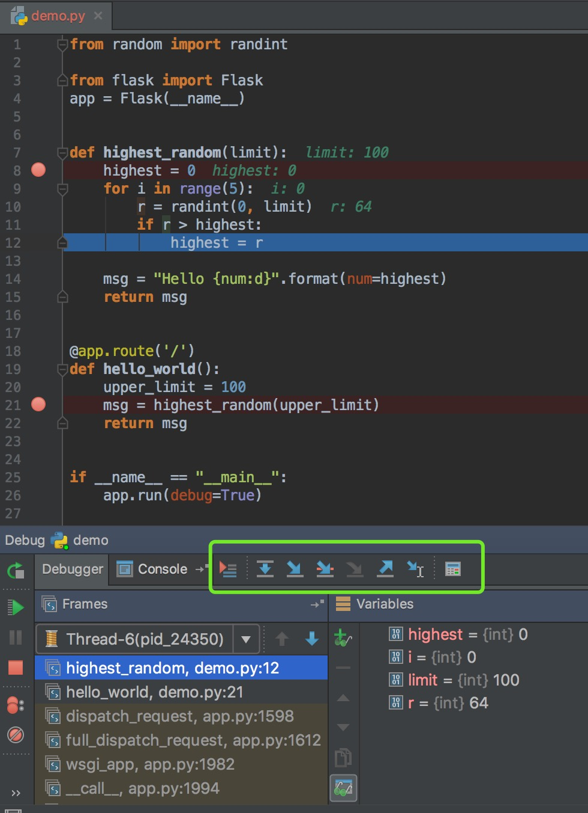
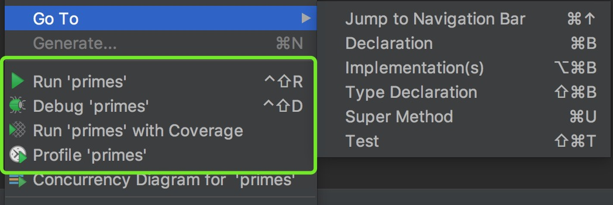

## DEBUG

调试的主要编程调试的方法主要有三类。

* 插入print语句

	简单易用，但功能十分受限，如果想查看其他变量或者变量的其他信息需要重新运行，对于大型项目这样做比较低效；另外上线之前要记得删除。
	
	如果喜欢这种方式的，更建议用logging代替，logging集成了终端和文件打印，可以设置debug模式，避免上线后依旧在打印输出。

```
# 简单打印到日志
import logging
logging.basicConfig(format='[%(asctime)s] %(name)s:%(levelname)s - %(message)s', filename="run.log")
logging.warning('is when this event was logged.')
```

```
# 定制格式，输出线程号，输出到命令终端和日志中
import logging

logger = logging.getLogger('')


def init_logger():
    # must run at first
    logger.setLevel(logging.DEBUG)
    # create file handler which logs even debug messages
    fh = logging.FileHandler('run.log')
    fh.setLevel(logging.DEBUG)
    # create console handler with a higher log level
    ch = logging.StreamHandler()
    ch.setLevel(logging.INFO)
    # create formatter and add it to the handlers
    formatter = logging.Formatter(
        '[%(asctime)s] - [%(relativeCreated)d : %(threadName)s] - [%(name)s:%(levelname)s] - %(message)s')
    ch.setFormatter(formatter)
    fh.setFormatter(formatter)
    # add the handlers to logger
    logger.addHandler(ch)
    logger.addHandler(fh)
```

* 使用IDE调试 (推荐)

	集成了单步调试、显示全部变量和调用栈等高级功能，但由于带GUI的IDE需要在本地运行，而代码开发和测试时一般在服务器运行，本地调试验证后，需要再同步线上再次验证。
	
	**非常建议使用这种方式！** 一方面不太建议在测试环境直接进行调试(不可能允许在线上调试)，测试服务器往往多人使用，调试中间一般会出现程序异常崩溃，造成无法访问。即使是测试环境依然会有相关的测试人员、同项目的开发人员在共同使用，频繁崩溃会干扰他人工作。

* 单步调试

	可以用ipdb，开发Python应用时常用的方法，满足了调试的几乎所有需求，不仅是调试，开发时使用ipdb也能快速验证代码和开发测试。但没有IDE直观方便，使用和学习成本都稍高。

```
# 使用方法一：
python -m ipdb xxx.py
	
# 使用方法二：
import ipdb; ipdb.set_trace()
```

## 断点

一个断点标记了一个代码行，当Pycharm运行到该行代码时会将程序暂时挂起。

**设置断点**



按上图示例：

1. 代码第8行、 第21行标有红色圆点，为断点，该行代码亦为红色
2. 第12行为蓝色，表示代码执行到该行
3. 7到10行 代码旁边有标记值，说明了当前变量状态
4. 下栏的 debugger 有一排按钮，常用的 F8 执行一步，F9 执行到下一断点。

可以在执行时，在未执行到的部分添加新断点，不断确认程序当前状态。

## Pycharm 调试示例
Flask程序示例：

```
#!/usr/bin/env python
# coding=utf-8
"""
__created__ = '3/13/17'
__author__ = 'madeling'
"""
from random import randint

from flask import Flask
app = Flask(__name__)


def highest_random(limit):
    highest = 0
    for i in range(5):
        r = randint(0, limit)
        if r > highest:
            highest = r

    msg = "Hello {num:d}".format(num=highest)
    return msg


@app.route('/')
def hello_world():
    upper_limit = 100
    msg = highest_random(upper_limit)
    return msg


if __name__ == "__main__":
    app.run(debug=True)

```

用Pycharm Run/执行程序，会启动Flask应用。 改为[虫子]标志的debug按钮，开启Debug模式，可以自己尝试调试。


## 测试程序

### 功能DEMO

```
def is_prime(number):
    """return True if *number* is prime."""
    for element in range(2, number):
        if number % element == 0:
            return False
    return True


def print_next_prime(number):
    """print the closest prime number larger than *number*"""
    index = number
    while True:
        index += 1
        if is_prime(index):
            print(index)

```

### unittest

如果你使用的是 Pycharm，可以在 is_prime 函数内点右键，进入 GOTO --> Test，会自动创建 unittest 测试类。

```
from unittest import TestCase


class TestIs_prime(TestCase):
    def test_is_prime(self):
        from primes import is_prime
        self.assertTrue(is_prime(5))

```

Pycharm识别 Unittest，执行时，会自动按测试模式，能够看到测试用例的执行状态。

### coverage test

覆盖测试。对整个项目而言，最需要知道的就是各功能的测试用例，验证状态是否达标。现在各种识别系统非常健全，能识别出来覆盖率。

执行coverage时，pycharm会要求安装插件，确认就可以。

执行完就能看到 is_prime 只有45% 覆盖，需要补充测试用例。

### PyTEST
unittest是测试的基础，只具备了简单的单元测试功能。

Pytest: [http://doc.pytest.org/](http://doc.pytest.org/)

真实的测试应用中，一般使用pytest居多，本部分内容较多，需要独立介绍。

### web测试
web应用不同于功能函数，拥有自己的完备体系，测试需要和不同框架配合验证每个环节。

举例来说，Flask验测需要 Setup 初始环境，退出后需要清理环境。

```
import os
import flaskr
import unittest
import tempfile

class FlaskrTestCase(unittest.TestCase):

    def setUp(self):
        self.db_fd, flaskr.app.config['DATABASE'] = tempfile.mkstemp()
        flaskr.app.config['TESTING'] = True
        self.app = flaskr.app.test_client()
        with flaskr.app.app_context():
            flaskr.init_db()

    def tearDown(self):
        os.close(self.db_fd)
        os.unlink(flaskr.app.config['DATABASE'])
        
    def test_login_logout(self):
	    rv = self.login('admin', 'default')
	    assert b'You were logged in' in rv.data
	    rv = self.logout()
	    assert b'You were logged out' in rv.data
	    rv = self.login('adminx', 'default')
	    assert b'Invalid username' in rv.data
	    rv = self.login('admin', 'defaultx')
	    assert b'Invalid password' in rv.data

if __name__ == '__main__':
    unittest.main()
```

另外也会有专业的第三方测试工具，给测试开发人员专用，比如Selenium等。r