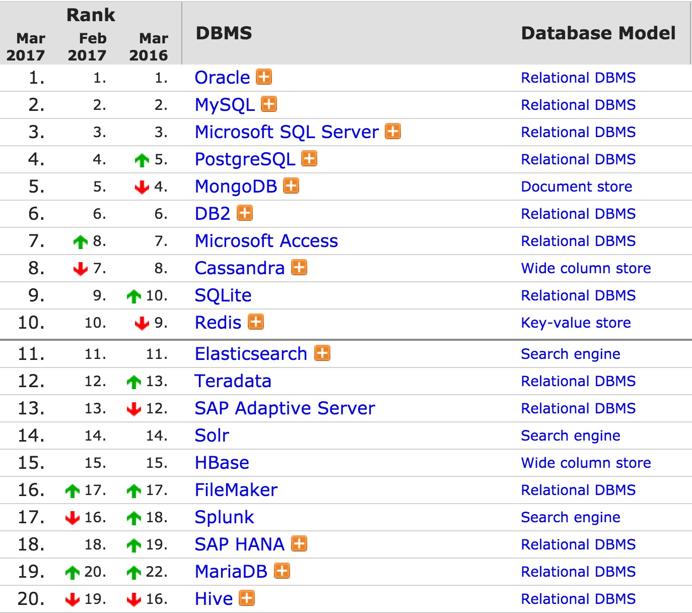
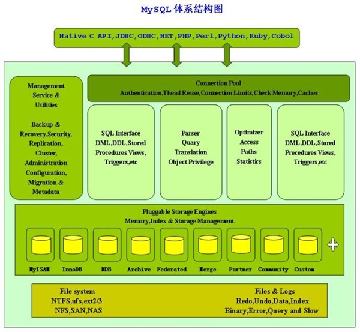
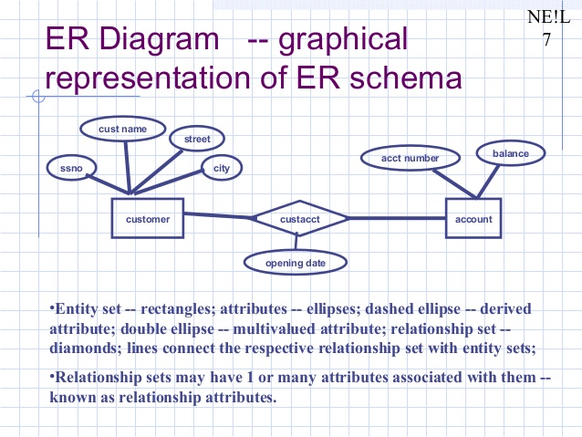
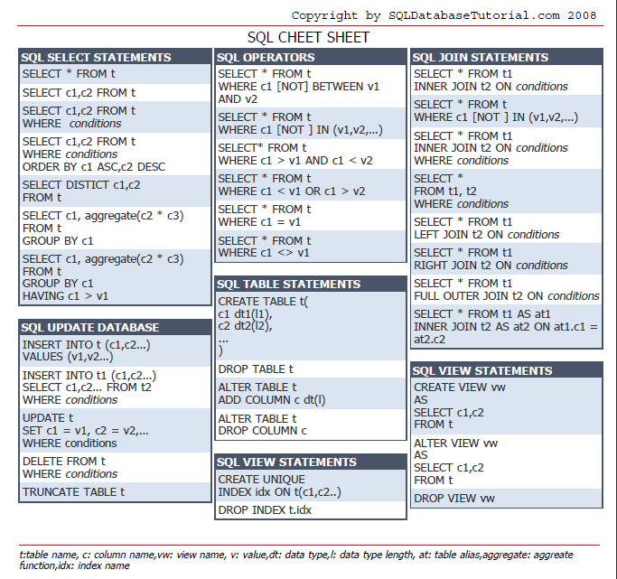

# 数据库
数据库排名: [http://db-engines.com/en/ranking](http://db-engines.com/en/ranking)

数据存储在计算机起始就产生，数据库也伴随着计算机不断发展，前后经历了以下几个阶段。

1. 1960s, navigational DBMS (网状和层次型数据库)
2. 1970s, relational DBMS (关系型数据理论)
3. Late 1970s, SQL DBMS (SQL 数据库)
4. 1980s, on the desktop (桌面数据库)
5. 1990s, object-oriented (面向对象数据库)
6. 2000s, NoSQL and NewSQL	(新型数据库)

其中关系型数据库和SQL，因为完备的理论体系和语言体系，目前依然是最主流应用的数据库。

历史久远的数据库一般不在讨论范围，新型数据库在最初尝试突破关系型数据库和SQL不够顺利，一定程度又回归了SQL应用。

所以现代数据库学习的基础依然是关系型理论和SQL。

## 关系型数据库

关系型数据库的核心基础：

1. 借助数学集合代数的理论基础
2. 定制SQL标准查询/处理语言
3. 数据库设计基于关系模型第一到第四范式
4. 具有ACID特性：Atomictiy(原子性)，Consistency(一致性)， Isolocation(隔离性), Durablity(持久性)

关系型数据库时代，按照设计范式预定义数据模型，借用SQL创建、更新和查询数据。以下为关系型数据库为保障数据的高可用所做的处理：

* 为防止磁盘崩溃，数据库有日志，两次写入，避免数据丢失；
* 最主要的容灾方案是主从备份
* 拥有内存锁，共享的数据结构排他操作
* 拥有事务锁，防止其他线程同时操作，操作出错，可以回滚
* 拥有缓存管理，数据按查询频率处理缓存级别

## E-R模型

ER模型，全称为实体联系模型、实体关系模型或实体联系模式图（ERD）（英语：Entity-relationship model）由美籍华裔计算机科学家陈品山发明，是概念数据模型的高层描述所使用的数据模型或模式图。

如果是企业级的数据库设计，一般都要有完备的ER模型设计。互联网应用很少做这部分的原因是：

1. 数据量太大，去外键、去关联、去关系校验，把这些放在程序层实现
2. 业务约束、事务关系，放在中间层控制实现
3. 反范式设计，将数据关系尽可能变成简单的增册改查

**但不代表每个应用都适应这样，更不代表完全没设计是好事情。**

## SQL

SQL参考表： [SQL Reference](http://www.cheat-sheets.org/sites/sql.su/)

基础内容较多，本部分不再详述，如有需要可以单独书写 **最佳实践**。

## 事务的隔离级别
对于数据库来说，通常都有一个默认的隔离级别，大多数情况下都是ReadCommitted。

- Oracle默认的是ReadCommitted。
- MySQL的默认事务隔离级别是Repeatable Read。

并非所有的数据库都支持这四种隔离级别，比如Oracle只支持Read Committed和Serializable，Mysql支持这四种。如果你指定的隔离级别当前数据库不支持的话，数据库会采用默认的隔离级别代替你指定的隔离级别。

1. READ\_UNCOMMITTED： 会出现脏读、不可重复读、幻读 (读数据时不加锁 )
2. READ\_COMMITTED：  会出现不可重复读、幻读问题【锁定正在读取的行。 在读数据之前加一个读锁，读完之后释放锁】
3. REPEATABLE\_READ： 会出幻读【锁定所读取的所有行。在读数据之前，加一个读锁，读完之后不释放锁，直到事务rollback或者commit后才释放锁】
4. SERIALIZABLE： 保证所有的情况不会发生。【锁表。在读数据之前，加锁（称为条件锁），读完之后不释放锁，直到事务rollback或者commit后才释放锁】

**注意：我们讨论隔离级别的场景，主要是在多个事务并发的情况下。**

各事务级别具体问题：

**Read uncommitted 读未提交**

领导把5000元打到A的账号上，但是该事务并未提交。而A正好去查看账户，发现工资已经到账，是5000元整。不幸的是，领导发现发给A的工资金额不对，是2000元，于是迅速回滚了事务，修改金额后，将事务提交。

出现上述情况，即我们所说的脏读，两个并发的事务，事务B读取了事务A尚未提交的数据。

**Read committed 读提交**

A拿着工资卡去消费，系统读取到卡里2000元，而此时她的老婆也正好在网上转账，把A工资卡的2000元转到另一账户，并在singo之前提交了事务。
当A扣款时，系统检查到singo的工资卡已经没有钱，扣款失败。

出现上述情况，即我们所说的不可重复读，两个事务并发，事务A事先读取了数据，事务B紧接了更新了数据。事务A再次读取/操作该数据时，数据已经变化。

当隔离级别设置为Read committed时，避免了脏读，但是可能会造成不可重复读。这是大多数数据库默认的级别。

**Repeatable read 重复读**
当A拿着工资卡去消费时，一旦系统开始读取工资卡信息（即事务开始），A的老婆就不能对该记录进行修改，也就是A的老婆不能在此时转账。

虽然Repeatable read避免了不可重复读，但还有可能出现幻读。

	目前工资为1000的员工有10人。
	1. 事务A，读取所有工资为1000的员工。
	2. 这时事务B 向employee表插入了一条员工记录，工资也为1000
	3. 事务A再次读取所有工资为1000的员工 共读取到了11条记录

**Serializable 序列化**

Serializable是最高的事务隔离级别，同时代价也花费最高，性能很低，一般很少使用，在该级别下，事务顺序执行，不仅可以避免脏读、不可重复读，还避免了幻像读。

## SQL高级查询
待补充
## 四种范式适用和扩展
待补充
## ACID特性及对性能的影响
待补充
## 关系型数据库的集合理论
待补充
## 事务、存储过程及触发器
待补充
## 模糊搜索、全文检索和多维查询
待补充
## 分库分表(sharding, partitioning)
待补充
