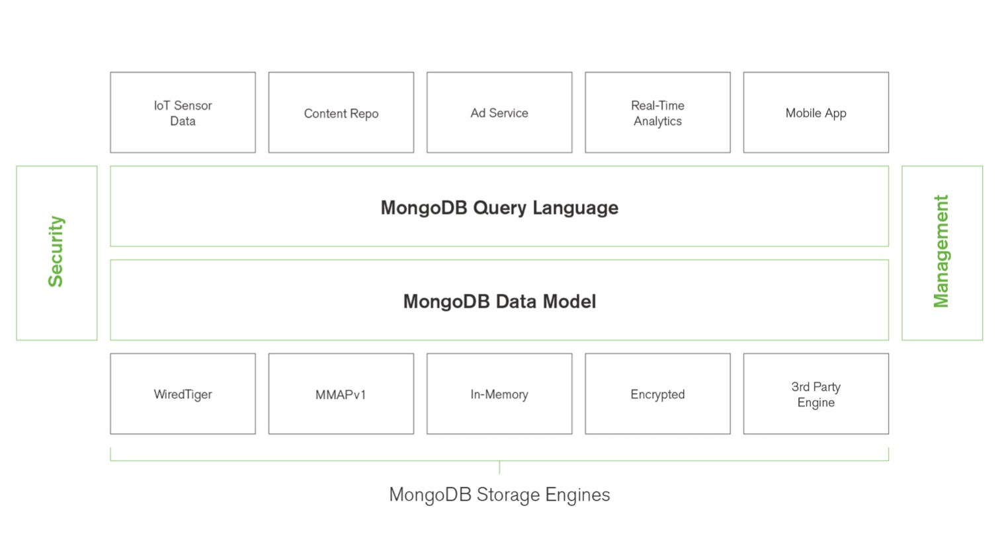
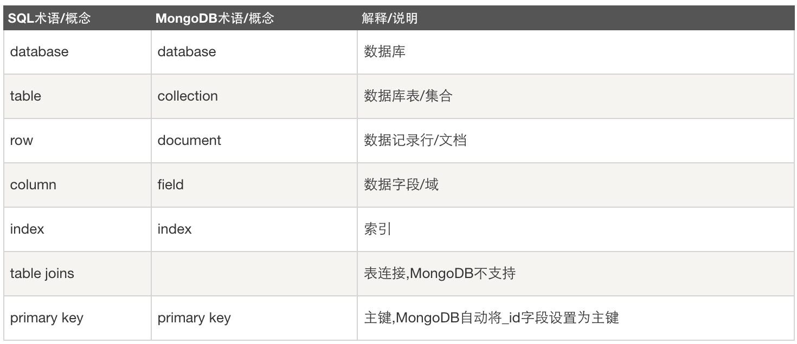

## MongoDB体系架构
MongoDB 是由C++语言编写的，是一个基于分布式文件存储的开源数据库系统。

MongoDB 旨在为WEB应用提供可扩展的高性能数据存储解决方案。将数据存储为一个文档，数据结构由键值(key=>value)对组成。文档类似于 JSON 对象。字段值可以包含其他文档，数组及文档数组。



## MongoDB特点

- MongoDB的提供了一个面向文档存储，嵌套文档、列表，可以动态扩展数据。
- 可以在MongoDB记录中设置任何属性的索引，支持文本索引搜索
- 可以通过本地或者网络创建数据镜像，使得MongoDB有更强的扩展性。
如果负载的增加（需要更多的存储空间和更强的处理能力），可以分布在计算机网络中的其他节点上，所谓的分片。
- 支持丰富的查询表达式；查询指令使用JSON形式的标记，可轻易查询文档中内嵌的对象及数组。
- 使用update()命令可以实时替换文档或者一些指定的数据字段。
- Map和Reduce: Mongodb中的Map/reduce主要是用来对数据进行批量处理和聚合操作。 
- GridFS是MongoDB中的一个内置功能，可以用于存放大量小文件。


## Schema Design


MongoDB中很多概念都可以和SQL相对应，虽然文档型数据库打破了关系型数据库的一些限制，但数据本身不是简单的 key-value，依然存在数据关系建模。

它的优势有时候也会成为最坏的地方：不存在 `ALTER TABLE` 操作，动态扩展数据结构。

**但如果初始Schema设计失败，重新设计就是完全重来。所以数据库初始结构设计非常重要。**

MongoDB的数据关系设计脱离了关系规范，官方提供了一些最佳实践，包括一对一，一对多，多对多关系的最佳设计实践。

> [http://blog.mongodb.org/post/87200945828/6-rules-of-thumb-for-mongodb-schema-design-part-1](http://blog.mongodb.org/post/87200945828/6-rules-of-thumb-for-mongodb-schema-design-part-1)
> 
> [http://blog.mongodb.org/post/87892923503/6-rules-of-thumb-for-mongodb-schema-design-part-2](http://blog.mongodb.org/post/87892923503/6-rules-of-thumb-for-mongodb-schema-design-part-2)
> 
> [http://blog.mongodb.org/post/88473035333/6-rules-of-thumb-for-mongodb-schema-design-part-3](http://blog.mongodb.org/post/88473035333/6-rules-of-thumb-for-mongodb-schema-design-part-3)

对应翻译网站：
> [http://www.jianshu.com/p/bb0caddff60a](http://www.jianshu.com/p/bb0caddff60a)
>
> [http://www.jianshu.com/p/21f5a73384d4](http://www.jianshu.com/p/21f5a73384d4)
>
> [http://www.jianshu.com/p/f383059e6102](http://www.jianshu.com/p/f383059e6102)


## 数据格式校验

大多数NoSQL数据库都是动态扩展，除了结构彻底失败之外，另外一个麻烦的问题是：控制数据质量。

简单的说，就是像传统数据库一样，有格式校验。

和一般NoSQL不同的是，MongoDB本身集成了入库格式校验：

```
db.createCollection( "contacts",
   { validator: { $or:
      [
         { phone: { $type: "string" } },
         { email: { $regex: /@mongodb\.com$/ } },
         { status: { $in: [ "Unknown", "Incomplete" ] } }
      ]
   }
} )
```

如果对mongodb本身的格式校验不够满意，想要进一步做更完备的校验。可以在程序层完成，推荐使用：

> [https://github.com/Julian/jsonschema](https://github.com/Julian/jsonschema)


## 数据查询

Mongodb的数据查询包括以下几类：

- Key-value queries 键值查询
- Range queries 范围查询
- Aggregation Framework 数据聚合
- Geospatial queries 地理位置查询
- Text Search 全文搜索
- JOINs and graph traversals 树/图遍历
- MapReduce queries 

键值&范围查询指南，参见与SQL对比：
> [https://docs.mongodb.com/manual/reference/sql-comparison/](https://docs.mongodb.com/manual/reference/sql-comparison/)

聚合查询指南，参见与SQL对比：
> [https://docs.mongodb.com/manual/reference/sql-aggregation-comparison/](https://docs.mongodb.com/manual/reference/sql-aggregation-comparison/)

后续相对高阶功能，待独立分享。

## 设计案例

待补充

## 性能实践

参见: [https://www.mongodb.com/zh/collateral/mongodb-performance-best-practices](https://www.mongodb.com/zh/collateral/mongodb-performance-best-practices)

包括：

- 应用程序模式、架构设计和索引编制
- 磁盘 I/O 注意事项
- 关于 Amazon EC2 的最佳实践
- 针对标准进行设计

