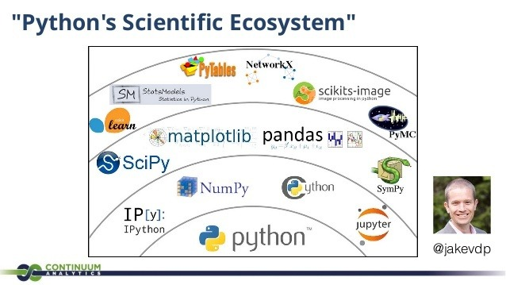

## Python数据科学

具体的教材书参见上图作者的书 [Python DataScience Handbook](https://github.com/jakevdp/PythonDataScienceHandbook)

## NumPy
提供了

  1. 一个强大的N维数组对象Array
  2. 矩阵数据类型、矢量处理，以及精密的运算库
  3. 实用的线性代数、傅里叶变换和随机数生成函数

## SciPy

SciPy函数库在NumPy库的基础上增加了众多的数学、科学以及工程计算中常用的库函数。

例如线性代数、常微分方程数值求解、信号处理、图像处理、稀疏矩阵等等。

## matplotlib

matplotlib 是python最著名的绘图库，它提供了一整套和matlab相似的命令API，十分适合交互式地进行制图。而且也可以方便地将它作为绘图控件，嵌入GUI应用程序中。

## pandas
pandas 是基于NumPy 的一种工具，该工具是为了解决数据分析任务而创建的。Pandas 纳入了大量库和一些标准的数据模型，提供了高效地操作大型数据集所需的工具，提供了大量能使我们快速便捷地处理数据的函数和方法。

**基础数据类型**

- Series：一维数组，与Numpy中的一维Array类似。
	
	> Array和Series与Python基本的数据结构List很相近，
	>
	> 其区别是：List中的元素可以是不同的数据类型，而Array和Series中则只允许存储相同的数据类型，这样可以更有效的使用内存，提高运算效率。
	> 
	> Series在Array的基础中添加序列索引。
	
- TimeSeries：以时间为索引的Series。
- DataFrame：二维的表格型数据结构。很多功能与R中的data.frame类似。可以将DataFrame理解为Series的容器。
- Panel ：三维的数组，可以理解为DataFrame的容器。