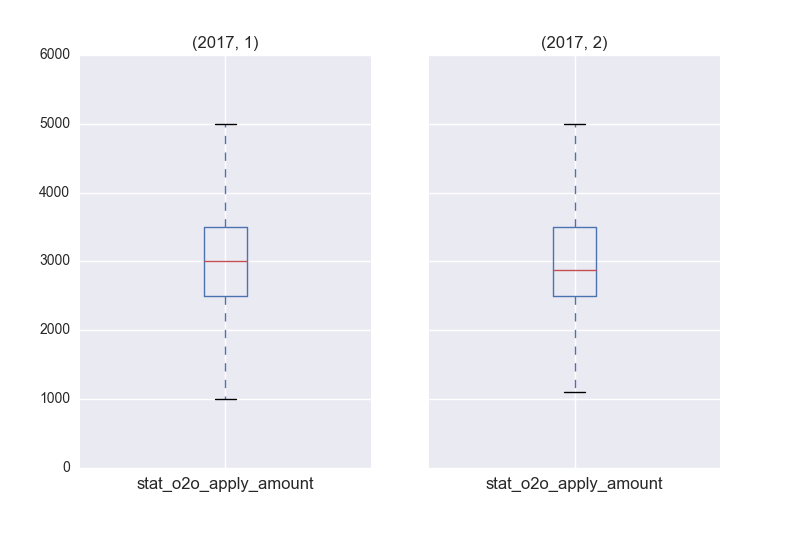
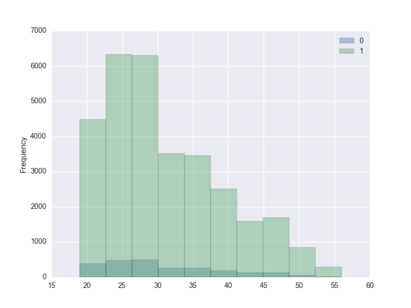

#模型迭代总结
>本文档总结了2017年5月的o2o消费贷模型迭代的一些坑，作为之后模型迭代的一些经验教训

##建模数据检查
>模型效果与之前变化很大，或者是模型在validation set上的表现跟test上有很大差距，不应该先从模型算法和参数入手检查问题，而是应该从数据的正确性入手。

>数据正确性需要从特征和label两个方面检查
###1. 特征
####1.1 缺失程度
> 在建模之前应该对每个数据源的特征缺失程度有一个大致的了解，如果超过了这个缺失度，则说明数据发生了异常，特别是对关键特征的检查。对于o2o消费贷业务，最重要的特征包括：gender, age, apply_amount

当前特征缺失的处理方法还比较粗糙，未来计划按类别和缺失原因进行处理：

+ 对于外部数据源，当前每个数据源都有一个特征来标记该用户是否缺失该数据源的特征 e.g. tongdun_miss
+ 对于内部数据，目前将关键特征缺失的用户数据删除，其他特征缺失补0

未来做法：
缺失原因

1. 完全随机缺失，即变量本身的缺失跟其他变量无关，例如婚姻
2. 随机缺失，即变量缺失依赖于其他变量，e.g. 配偶依赖于婚姻状况
3. 完全非随机缺失：缺失值依赖于自己，e.g. 高收入人群不愿意透露收入

####对于类别型特征
对于随机缺失：将缺失作为一种类别

对于完全非随机缺失：

- 从其他样本中抽样补缺
- 用均值补缺：均值容易受到极端值影响，因此使用前可以先删除均值

####对于连续型特征
+ 删除缺失率超过30%的变量：视情况而定
+ 用随机抽样法对缺失补充
+ 用均值补充：先删除极端值
+ 用最常出现的值代替缺失

####1.2 是否与label相关
用户的特征矩阵中，与其当前或历史逾期情况相关的特征可能与label过于相关，这种类型的特征不应该出现在模型特征中，而是应该作为强拒绝规则 (cannot through the door)

检查方法是查看特征与label之间的关联程度, pearson correlation，如果绝对值过高则需要去掉

####1.3 特征分布/统计值
> 为了避免极端值的影响，可以使用0.95分位点下的截断分布

####特征的统计情况
在进行特征检查时，计算每个特征的统计值，可以教明显地观察出哪些特征出了问题：

+ 均值：容易受极值影响
+ 标准差：特征的稳定性
+ 各分位点值：取等距分位点，在最后一个分位点数值变大正常，因为通常数据分布在尾部会变稀疏

####特征随时间的变化
画出特征值随时间变化的曲线或箱线图，可以清晰地观察出特征是否随时间有较大变化

例如标记用户是否是少数民族的特征就可以用该方法检验出来，在2017年之后，消费贷关闭了绝大部分少数民族门店

####特征与事件的分布
即该特征在不同事件(e.g. 评分卡模型中的事件是逾期vs.未逾期，反欺诈模型中的事件是欺诈vs.正常)中的分布情况，因此可以直观地看出该特征是否对事件有区分度

从下图可以看出，在各年龄段，逾期用户(label=0)的占比变化并不十分明显，因此推断年龄并不是一个具有区分度的特征，这一推断在模型feature importance中也得到了验证

### 2. label

####2.1 逾期指标变化对label的影响
根据业务的变化，用户的整体逾期率可能会发生较大变化。例如2017年之后用户的fpd5, 10都比2017年之前的用户降低很多，有些月份甚至降到了之前的一半。这样会导致的问题是，模型训练数据与验证数据的用户分布不同，最明显的表现是在PSI上。

由于训练用户好坏比与验证用户好坏比显著不同，两部分用户的PSI在高分段和低分段用户的比例也明显不同，因此会导致模型在train和test上打分不稳定。

####2.2 未到期用户对label的影响
这是一个比较难避免的问题，即在提取用户特征&label时，查询语句是按照用户的申请时间filter的，但是用户的订单生成时间与其申请时间之间可能会有一个时间窗口，即一个用户在时间A申请，但其订单可能是在A+T时间点才生成。但用户的还款时间还是以用户的申请时间推算的，所以会发生一部分用户在其按申请时间推算的还款时间点上还未到期，而代码逻辑是label为空即代表该用户是被拒绝的，因此会被自动填充为0。而该用户的label是不确定的，因此这种情况会导致用户的label被标错，极大影响了模型判断的准确性

该部分用户label的解决方法是，用-1填充这部分用户的label，在准备模型训练数据时将这部分用户删除

####2.3 通过但未生成订单用户对label的影响
该部分用户的pass_status是1，但最终未生成订单，即该部分用户的label是无法预测的。而代码逻辑是判断如果该用户的pass_status是1，并且逾期天数<=n (fpdn)，即该用户是好用户，但对于未生成订单用户，这种判断逻辑是错误的。并且该部分用户的占比在5%-6%左右，比例非常高，以至于对用户label的准确行和模型判断的准确性影响非常大。
当前的解决方法是将该部分用户当做了outliers，在获取训练数据时就去掉了

##模型分数映射
新版模型分数映射采用逾期率映射法：先验地设置好每个决策区间的期望逾期率

+ 先将用户按其模型输出probability排序(从小到大)
+ 等分分为n(预先设置好的)个bins
+ 合并相邻的bins，直到该部分用户的逾期率显著区别于预先设置好的逾期率
+ 是否显著区别的判断标准是如果该区间用户的逾期率超过了one-sample score z-test在置信区间为0.95下的threshold，且为了避免陷入局部陷阱，规定超过两次该threshold才会被判定为显著区别
+ 此时停止合并，并且将当前已合并的bins作为一个决策区间，以用户的Probability最大和最小作为判断标准

本次消费贷模型采用的决策区间以及对应分数为：

决策区间|对应分数段|对应策略|期望人数占比
-------|---------|-------|----------
A	   |[80, 100) |简版答题卡|	25%
B	   |[60, 80) |简版答题卡|25%
C	   |[40, 60) |完整答题卡|20%
D	   |[20, 40) |电核	 |20%
E	   |[0, 20)	 |拒绝	 |10%

在每个小区间的分数映射上，由于在高分段用户的model probability是非均匀分布的，为了使用户映射分数在决策区间上呈现均匀分布，此次分数映射采用分位点映射法：
probability区间对应的每5%分位点，映射到分数区间的每一分上，e.g.：

A区间probability的

- 5%分位点 -> 80分
- 10%分位点 -> 81分
- 15%分位点-> 82分
- ......
- 95%分位点 -> 98分
- 100%分位点 -> 99分

该映射法可以保证高probability对应高映射分，且映射分数分布相对均匀

##模型参数
###LightGBM
lgb对l2 regularization系数敏感，l2系数可以很好地控制过拟合情况
L1, L2的参数设置可以在[1e-6, 0.1)之间选择

###XGBOOST
colsample_bytree (列抽样)和subsample (行抽样)可以很好地防止xgboost过拟合
一般列抽样和行抽样的比例为[0.8, 1.0)，过小的行、列抽样比例会导致模型不稳定或者欠拟合
