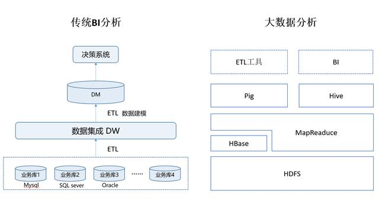

# 2. 数据服务
- 业务数据库：MySQL, MongoDB
- 数据中心/数据仓库：Hadoop, HBase, ElasticSearch
- 缓存: Redis
- 消息队列：RabbitMQ，kafka
- 数据可视化：Kibana, SuperSet
- 数据智能：机器学习sk-learn, xgboost

## 第一期规划

**6月12日 至 6月23日**

梳理问题，建立标准：

1. 梳理现有的数据库，确认各业务使用情况
2. 确认现在的数据库部署方案、机器配置、连接配置、超时配置、引擎配置等…
3. 什么样的数据放在 MySQL？哪些放在MongoDB？
4. 什么情况下使用Hadoop/Hbase？用到了什么，解决了什么？
5. 数据查询建议及标准(SQL, Json-Query)，查询最佳实践标准

## 第二期规划

**6月26日 至 7月7日**

1. 关系型数据库的使用及设计规范？
2. 确认Redis缓存的使用规范，特别是永久化缓存的清理规范
3. 确认消息队列或时间序列数据库在业务中的具体使用和规范…
3. 分库分表？库、表和项目之间的关系规范？
4. NoSQL数据的使用场景？schema设计规范是什么？
5. MongoDB和Elk都有全文查询、MapReduce、机器学习，如何使用、如何定位他们场景？
6. Kibana 和 SuperSet 等可视化界面的应用

## 第三期规划
**7月10日 至 7月21日**

建立数据仓库

1. 分析型数据仓库设计：数据如何路由聚合
2. 如何利用Hadoop和Hive/impala等工具解决大数据量的问题
3. 如何利用ElasticSearch解决数据搜索引擎的问题
